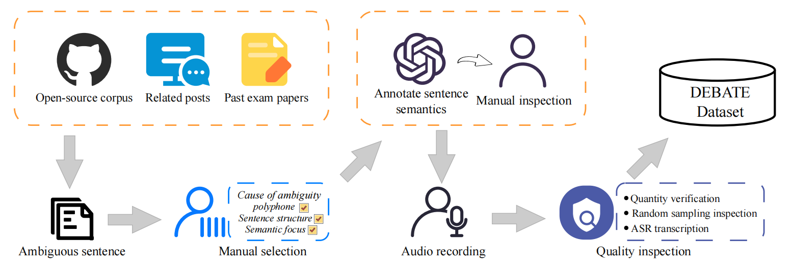

# DEBATE: A Dataset for Disentangling Textual Ambiguity in Mandarin Through Speech
[](https://arxiv.org/abs/2506.07502)  [](https://github.com/SmileHnu/DEBATE) [](https://zenodo.org/records/15609922)

This is the official repository of the DEBATE dataset, containing detailed information related to the dataset.
<div align="center"></div>

## DEBATE Overview

DEBATE dataset is a unique public Chinese speech-text dataset designed to study how speech cues and patterns—pronunciation, pause, stress and intonation—can help resolve textual ambiguity and reveal a speaker’s true intent.It contains 1,001 carefully selected ambiguous utterances, each recorded by 10 native speakers. 

The table below provides the detailed statistics of the DEBATE dataset.
|   Tasks  | Samples | Hours | Mean Duration(s) | Duration Range(s) |
|:--------:|:-------:|:-----:|:----------------:|:-----------------:|
|Task_Proun| 2000    |1.64   |2.94              |1.15-5.80          |
|Task_Pause| 4010    |4.28   |3.84              |1.60-11.80         |
|Task_Stres| 4000    |3.74   |3.37              |1.43-8.51          |
|**Total** |**10010**|**9.66**|**3.47**         |**1.15-11.80**     |

## DEBATE Dataset Usage
DEBATE dataset is publicly available at [Zenodo](https://zenodo.org/records/15609922). All audio files and annotation files can be downloaded from here. <i>Please note that users are permitted to use this dataset only for non-commercial purposes under the CC BY-NC-4.0 license.</i>

## Dataset Construct
<div align="center"></div>
The text was collected from three primary sources:<br>
&nbsp;&nbsp;&nbsp;&nbsp;&bull; open-source corpora<br>
&nbsp;&nbsp;&nbsp;&nbsp;&bull; social media platforms<br>
&nbsp;&nbsp;&nbsp;&nbsp;&bull; standardised examination question banks<br>
After collecting the text, we performed systematic manual annotation to classify the data into three distinct types of ambiguity: <i>polyphonic character ambiguity</i> , <i>structural ambiguity</i> , and <i>focus ambiguity</i>. To further enhance the usability of this dataset in semantic understanding and downstream evaluation tasks, we generated semantic annotations for each sentence. <br>
We recruited ten speakers with balanced demographic characteristics and used a two-person collaborative recording procedure with mobile phones. Real-time monitoring was conducted during the recording process, and all audio files were resampled to 16 kHz.<br>
The dataset quality was checked using the following methods:<br>
&nbsp;&nbsp;&nbsp;&nbsp;&bull; Verifying whether the number of audio files for each task per speaker was correct<br>
&nbsp;&nbsp;&nbsp;&nbsp;&bull; Randomly sampling audio files for inspection<br>
&nbsp;&nbsp;&nbsp;&nbsp;&bull; Conducting audio CER testing using ASR models

## Data storage schema
The audio file storage structure is shown below, where x represents the speaker ID (0–9).

<i>DEBATE_Audio</i><br>
&nbsp;&nbsp;&nbsp;-speaker_x<br>
&nbsp;&nbsp;&nbsp;&nbsp;&nbsp;&nbsp;-<i>polyphone</i><br>
&nbsp;&nbsp;&nbsp;&nbsp;&nbsp;&nbsp;&nbsp;&nbsp;&nbsp;&nbsp;&nbsp;&nbsp;<i>sx_p_id_000.wav</i><br>
&nbsp;&nbsp;&nbsp;&nbsp;&nbsp;&nbsp;&nbsp;&nbsp;&nbsp;&nbsp;&nbsp;&nbsp;<i>sx_p_id_001.wav</i><br>
&nbsp;&nbsp;&nbsp;&nbsp;&nbsp;&nbsp;-<i>segment</i><br>
&nbsp;&nbsp;&nbsp;&nbsp;&nbsp;&nbsp;&nbsp;&nbsp;&nbsp;&nbsp;&nbsp;&nbsp;<i>sx_seg_id_000.wav</i><br>
&nbsp;&nbsp;&nbsp;&nbsp;&nbsp;&nbsp;&nbsp;&nbsp;&nbsp;&nbsp;&nbsp;&nbsp;<i>sx_seg_id_001.wav</i><br>
&nbsp;&nbsp;&nbsp;&nbsp;&nbsp;&nbsp;-<i>stress</i><br>
&nbsp;&nbsp;&nbsp;&nbsp;&nbsp;&nbsp;&nbsp;&nbsp;&nbsp;&nbsp;&nbsp;&nbsp;<i>sx_s_id_000.wav</i><br>
&nbsp;&nbsp;&nbsp;&nbsp;&nbsp;&nbsp;&nbsp;&nbsp;&nbsp;&nbsp;&nbsp;&nbsp;<i>sx_s_id_001.wav</i><br>
The folders <code><i>polyphone</i></code>, <code><i>segment</i></code>, and <code><i>stress</i></code> correspond to the three text annotation files: <code><i>Task_Proun.xls</i></code>, <code><i>Task_Pause.xls</i></code>, and <code><i>Task_Stres.xls</i></code>, respectively. Each file contains three columns:<br>
&nbsp;&nbsp;&nbsp;&nbsp;&bull; the transcribed sentence<br>
&nbsp;&nbsp;&nbsp;&nbsp;&bull; the corresponding audio ID<br>
&nbsp;&nbsp;&nbsp;&nbsp;&bull; the semantic annotation of the sentence meaning<br>
Additionally, <code><i>Task_Proun.xls</i></code> includes an extra column specifying the exact pronunciation of the polyphonic character. The <code><i>metadata.xls</i></code> contains the ID, age, gender, and regional information of the recording volunteers.

## Reference
If you use the DEBATE dataset, please cite the following paper:
```bibtex
```

Comments on the experience with the dataset, using the following email, would be highly appreciated. <br>
haotianguo@hnu.edu.cn

