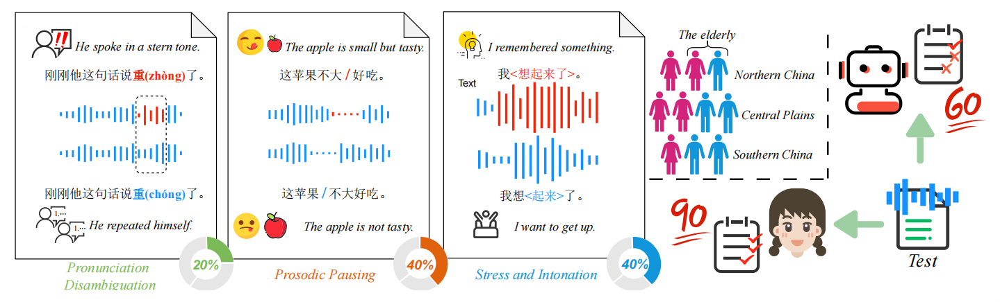

# DEBATE: A Dataset for Disentangling Textual Ambiguity in Mandarin Through Speech
[]   

  

## Dataset Overview
## Dataset Download
Zenodo：[download](https://zenodo.org/records/15609922)
## Construct Pipeline

  

